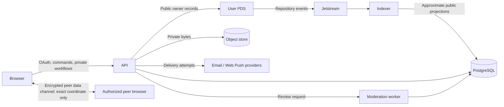
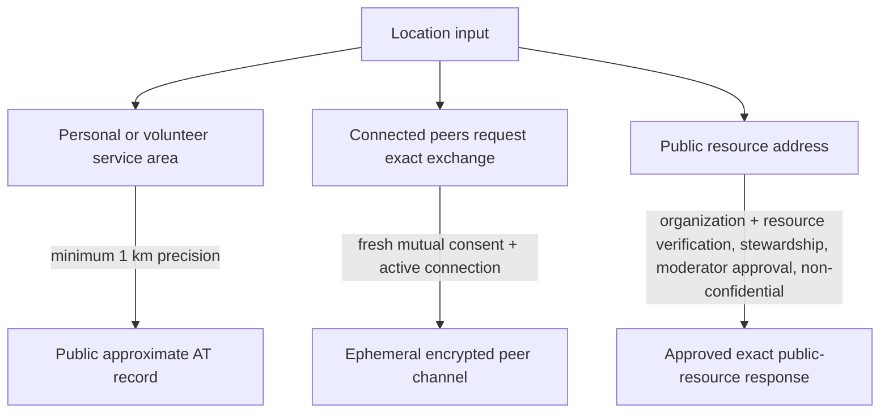

# Patchwork domain map

Updated: 2026-08-05

ADR 0003 defines data placement. [Postal geography](./postal-geography.md)
defines request ZIPs and eligible public-resource locations.

## Buyer-ready bounded contexts

| Domain | Authority | Runtime owner | Public/product boundary |
| --- | --- | --- | --- |
| Identity and consent | User PDS for DID identity; PostgreSQL for encrypted OAuth/session state, versioned consent, and preferences | API | Managed account creation and existing-account OAuth converge on cookie-backed sessions; browser identity and privilege fields are ignored |
| Public aid, directory, and volunteer records | User AT repository | API command boundary and AT client | Authenticated owner CRUD; requests publish ZIP-only location; volunteer profiles publish a service area |
| Ingestion and discovery | Repository authority observed through Jetstream; rebuildable PostgreSQL projections | Indexer writes, API reads | Anonymous map/feed/directory/volunteer queries with projection freshness and authenticated block filtering |
| Organizations and verification | PostgreSQL | API | Membership/stewardship, private evidence metadata, annual decisions/appeals, and separate exact-public-address approval |
| Private request coordination | PostgreSQL | API | Lifecycle, advisory matching, offers, connections, activity inbox, and outcomes; participant identity stays private until authorized |
| Connection scheduling | PostgreSQL | API | Versioned UTC windows plus originating IANA timezone for active accepted-connection participants; no location field |
| Groups | PostgreSQL | API | Role-controlled memberships and rooms with hashed, expiring, single-use invitations and optional request-intersection authorization |
| Bounded text chat | PostgreSQL | API | Server-readable text for active accepted connections or current room members; no body in URLs, list previews, notifications, audits, or moderation history |
| Exact personal location | Browser memory and an authenticated encrypted WebRTC peer channel | Web peers; API authorizes short-lived signaling | Fresh mutual consent on an active connection; coordinates never enter signaling, PostgreSQL, AT records, exports, notifications, logs, or backups |
| Attachments | Private S3-compatible object store for bytes; PostgreSQL for metadata/jobs | API and attachment workers | Authenticated purpose/ownership, type detection, 10 MB limit, malware scanning, transforms, clean-only short-lived access, and deletion reconciliation |
| Notifications | PostgreSQL durable outbox and delivery attempts | API/notification worker | In-app center plus opted-in email and browser push; private payload fields are forbidden |
| Moderation and maintenance | PostgreSQL queue, review, urgent-event, audit, appeal, and maintenance state | Moderation worker and API | Pre-publication fail-closed gate, capability-gated console, read-only shutdown, and audited resume |
| Showcase provenance | Server-controlled PostgreSQL metadata plus projection origin columns | Showcase seed and normal runtime defaults | `synthetic`, `sourced-public`, and `visitor-created` remain distinct; sourced organizations carry provenance and non-participation copy |
| Observability | Metrics backend, redacted logs, and bounded operational records | All services | Health/readiness/status/metrics; no credential, exact-person-location, private evidence, or raw moderation content |

## Data flow

1. Authentication establishes a server-restored DID; current consent gates
   protected actions.
2. Public owner records pass the pre-publication safety gate and are written
   to the owner's PDS.
3. The indexer validates repository events and transactionally updates
   approximate discovery projections and its cursor.
4. Private workflow, scheduling, group, chat, organization, verification,
   attachment, notification, moderation, and maintenance state remains in
   PostgreSQL/object storage.
5. Exact personal coordinates can move only between freshly authorized peer
   browsers and disappear when the exchange closes.

## Location contracts

## Anti-corruption boundaries

- `packages/at-client` adapts official OAuth/repository APIs and contains no
  product authority.
- `packages/at-lexicons` validates public AT shapes; private evidence,
  connection state, notification delivery, and moderation casework have no
  public lexicon.
- `packages/shared` owns transport-neutral schemas and redaction rules without
  importing service persistence.
- The API derives the actor from its session for every authenticated command.
- Origin, verification, moderation, exact-address approval, and role fields
  are server-controlled and cannot be asserted by a browser or AT record.

## Deliberately deferred contexts

Offline mutation synchronization/PWA, native mobile, multi-region tenancy,
external partner connectors, and reputation remain outside this roadmap.
Scheduling, groups, and bounded text chat now have durable production paths;
that feature completion does not change the operational `NO-GO`.
